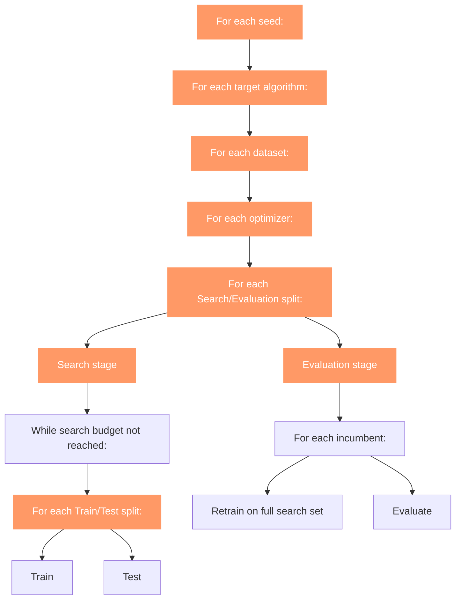
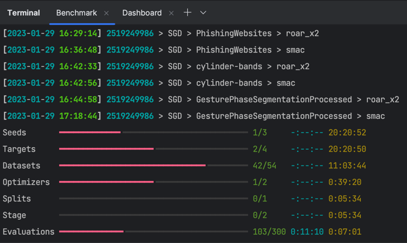

## Overview

Here is a schematic overview of how the benchmarks are performed:

| Set                      | Description                                                                                                                                                                                                                                                                                                                                                                                                                                                                                                                                                                                                                                                           |
|--------------------------|-----------------------------------------------------------------------------------------------------------------------------------------------------------------------------------------------------------------------------------------------------------------------------------------------------------------------------------------------------------------------------------------------------------------------------------------------------------------------------------------------------------------------------------------------------------------------------------------------------------------------------------------------------------------------|
| Seeds                    | The seed is used for reproducability. Using a particular seed makes sure that when you re-run the experiment with this seed, you will get the same results.                                                                                                                                                                                                                                                                                                                                                                                                                                                                                                           |
| Target algorithms        | The algorithm that we want to optimize. The goal of the optimizer is to find the best set of parameters (configuration) for this algorithm.                                                                                                                                                                                                                                                                                                                                                                                                                                                                                                                           |
| Datasets                 | The dataset we will use to evaluate the target algorithm with different configurations.                                                                                                                                                                                                                                                                                                                                                                                                                                                                                                                                                                               |
| Optimizers               | The optimizer that is being benchmarked. The optimizer will attempt to find the best configuration for the target algorithm.                                                                                                                                                                                                                                                                                                                                                                                                                                                                                                                                          |
| Search/Evaluation splits | For every split, the samples in the dataset are assigned to either the search set or the evaluation set. The search set is then used by the optimizer to find the best configuration.                                                                                                                                                                                                                                                                                                                                                                                                                                                                                 |
| Stages                   | - In the __search stage__, the optimizer only has access to the search set. To validate each configuration, the search set is split into multiple train/test splits. The target algorithm is trained on the train set, and its performance is measured on the test set. Every time the optimizer decides on a new 'best' configuration (a.k.a. incumbent), this is recorded. The record of incumbents is called a "trajectory".  - In the __evaluation stage__, Hyperbench re-plays the trajectory onto the evaluation set. This is done by retraining the incumbent configurations onto the complete search set, and then evaluating them on the evaluation set. |

## Tracking progress of the benchmark
During the execution of the benchmark, Hyperbench will display a set of progress bars with timestamped log messages 
above it.

The progres bars correspond to the orange boxes in the schematic view above.
The log messages show a timestamp and the current combination of 
`seed > target algorithm > dataset > optimizer` that is being evaluated.

