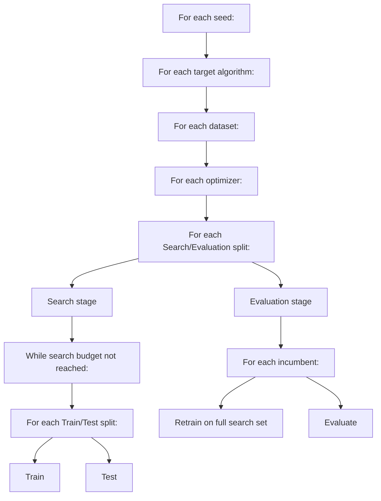

## Overview

Here is a schematic overview of how the benchmarks are performed:

Where:
- **Seed:** Makes sure that when you re-run the experiment with this seed, you will get the same results.
- **Target algorithm:** The algorithm that we want to optimize. The goal of the optimizer is to find the best set of parameters (configuration) for this algorithm.
- **Dataset:** The dataset we will use to evaluate the target algorithm with different configurations.
- **Optimizer:** The optimizer that is being benchmarked. The optimizer will attempt to find the best configuration for the target algorithm.
- **Search/Evaluation split:** For every split, the samples in the dataset are assigned to either the search set or the evaluation set. The search set is then used by the optimizer to find the best configuration.
- **Incumbent:** A configuration that was considered to be the best performing one at some point during the search stage. During the search stage we record these every time a configuration is swapped for a "better" configuration.
- **Train/test splits:** To validate each configuration, the search set is split into multiple train/test splits. The target algorithm is trained on the train set, and its performance is measured on the test set.
