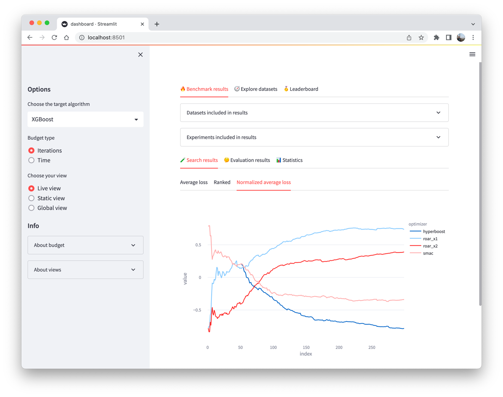

Hyperbench is a benchmarking framework for evaluating hyperparameter optimization (HPO) algorithms. 
The main features of Hyperbench are:
1. A modern terminal logging and progress display built on [rich](https://github.com/Textualize/rich).
2. A detailed dashboard built on [Streamlit](https://streamlit.io/) to view and compare the results.
3. Integration with [OpenML](https://www.openml.org/) to automatically download datasets for the benchmark.
4. Integration with [SMAC](https://github.com/automl/SMAC3), a high-performing and versatile HPO tool.
5. Can run easily on a personal computer or laptop, or it can be split up into multiple parts that run in parallel.
6. Easily extendible with your own datasets, target algorithms, optimizers, etc.

## Setup guide

First, clone the repository and run `pip install` to install all the requirements.

Secondly, you will need to create a file to configure how the benchmark should run. An example can be found below.

```python3
# your_benchmark.py

import openml
from sklearn.model_selection import StratifiedShuffleSplit, ShuffleSplit
from smac.facade.roar_facade import ROAR
from smac.facade.smac_hpo_facade import SMAC4HPO
from hyperbench.benchmark import BenchmarkConfig, BenchmarkRunner
from hyperbench.hyperboost import HyperboostEPM
from hyperbench.provider import OpenMLProvider
from hyperbench.optimizers import SMACBasedOptimizer
from hyperbench.target_algorithms import SVM, RandomForest, SGD, XGBoost
from hyperbench.transformer import SimpleTransformer

benchmark = BenchmarkConfig(
    
    # Fills missing values in dataset
    transformer        = SimpleTransformer(), 
    
    # The results will be stored here
    output_folder      = "results",           
    
    # Used to evaluate target algorithm
    scoring            = "balanced_accuracy", 

    # Used to initialize the optimizer. The seed is used for reproducibility
    seeds              = [2268061101, 2519249986, 338403738],
    
    # The algorithms we want to optimize. The optimizer attempts to find the best configuration
    target_algorithms  = [RandomForest(), XGBoost(), SGD(), SVM()],
    
    # The datasets that we will use to evaluate the target algorithm with different configurations
    datasets           = [OpenMLProvider(task) for task in openml.study.get_suite(99).tasks],
    
    # The optimizers that are being benchmarked.
    optimizers         = [
        SMACBasedOptimizer(ROAR,     "roar",       budget_multiplier=2),
        SMACBasedOptimizer(SMAC4HPO, "smac",       budget_multiplier=1),
        SMACBasedOptimizer(SMAC4HPO, "hyperboost", budget_multiplier=1, model=HyperboostEPM)
    ],
    
    # Splits the data (multiple times) into a search and evaluation set
    # (Find more info in concepts section)
    search_eval_splits = StratifiedShuffleSplit(n_splits=1, test_size=0.25, random_state=0),
    
    # The budget in iterations or seconds
    budget             = 300,  
    time_based         = False,
    
    # Splits the search set into train and test splits 
    # (Find more info in concepts section)
    train_test_splits  = ShuffleSplit(n_splits=3, random_state=0, test_size=0.10),
    
)

if __name__ == "__main__":
    BenchmarkRunner(benchmark).start()
```

To run the benchmark, use the command `python your_benchmark.py`.  This will show the progress of the benchmark.

## Viewing the results
Hyperbench comes with a dashboard built on Streamlit.
It can be started with `streamlit run dashboard.py`, after which it will be accessible via `localhost:8501`.


A live demo of the dashboard can be found [here](https://yatoom-hyperbench-dashboard-9uw27z.streamlit.app/).

The dashboard comes with a variety of graphs, tables, statistics and options. In the benchmark results, you can choose 
which target algorithm you would like to see the graphs for, you can filter on datasets, and you can choose one of the following views:

| View   | Description                                                                                                                                                                                                                                                                                                                 |
|:-------|:----------------------------------------------------------------------------------------------------------------------------------------------------------------------------------------------------------------------------------------------------------------------------------------------------------------------------|
| Live   | Filters the results by the datasets that are completed by all experiments. This is especially useful when one experiment is running because it allows you to compare it with other optimizers on the same set of datasets. Once your running optimizer finishes another dataset, you can press `r` to update the dashboard. |
| Static | Only includes experiments that have completed searching and evaluating on all datasets.                                                                                                                                                                                                                                     |
| Global | Includes everything, but might not accurately reflect the relative performance of the uncompleted experiments. Especially the average loss graph might be off.                                                                                                                                                              |

## Concepts
The benchmark consists of a lot of loops. Here is a schematic overview of how the benchmarks are performed:


The orange colored boxes are tracked with a progress bar in the terminal.

| Set                      | Description                                                                                                                                                                                                                                                                                                                                                                                                                                                                                                                                                                                                                                                            |
|--------------------------|------------------------------------------------------------------------------------------------------------------------------------------------------------------------------------------------------------------------------------------------------------------------------------------------------------------------------------------------------------------------------------------------------------------------------------------------------------------------------------------------------------------------------------------------------------------------------------------------------------------------------------------------------------------------|
| Seeds                    | The seed is used for reproducability. Using a particular seed makes sure that when you re-run the experiment with this seed, you will get the same results.                                                                                                                                                                                                                                                                                                                                                                                                                                                                                                            |
| Target algorithms        | The algorithm that we want to optimize. The goal of the optimizer is to find the best set of parameters (configuration) for this algorithm.                                                                                                                                                                                                                                                                                                                                                                                                                                                                                                                            |
| Datasets                 | The dataset we will use to evaluate the target algorithm with different configurations.                                                                                                                                                                                                                                                                                                                                                                                                                                                                                                                                                                                |
| Optimizers               | The optimizer that is being benchmarked. The optimizer will attempt to find the best configuration for the target algorithm.                                                                                                                                                                                                                                                                                                                                                                                                                                                                                                                                           |
| Search/Evaluation splits | For every split, the samples in the dataset are assigned to either the search set or the evaluation set. The search set is then used by the optimizer to find the best configuration.                                                                                                                                                                                                                                                                                                                                                                                                                                                                                  |
| Stages                   | In the __search stage__, the optimizer only has access to the search set. To validate each configuration, the search set is split into multiple train/test splits. The target algorithm is trained on the train set, and its performance is measured on the test set. Every time the optimizer decides on a new 'best' configuration (a.k.a. incumbent), this is recorded. The record of incumbents is called a "trajectory". <br/><br/>In the __evaluation stage__, Hyperbench re-plays the trajectory onto the evaluation set. This is done by retraining the incumbent configurations onto the complete search set, and then evaluating them on the evaluation set. |


